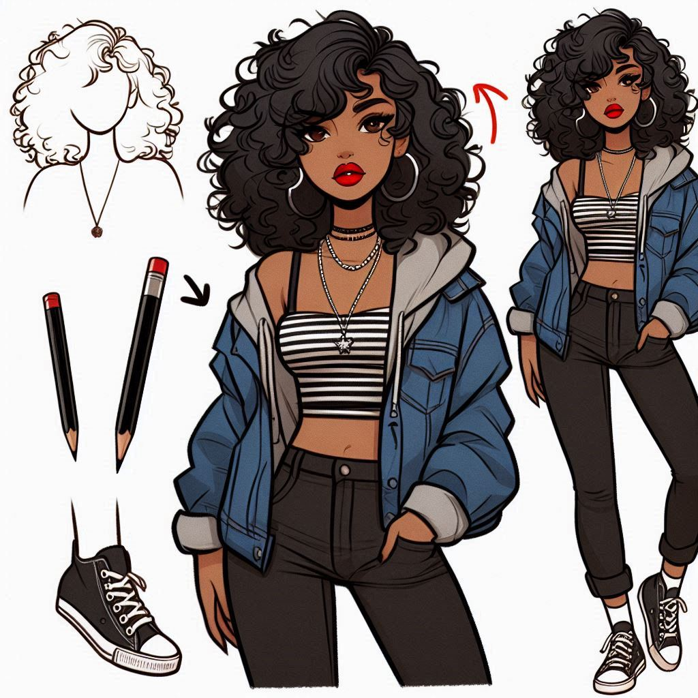
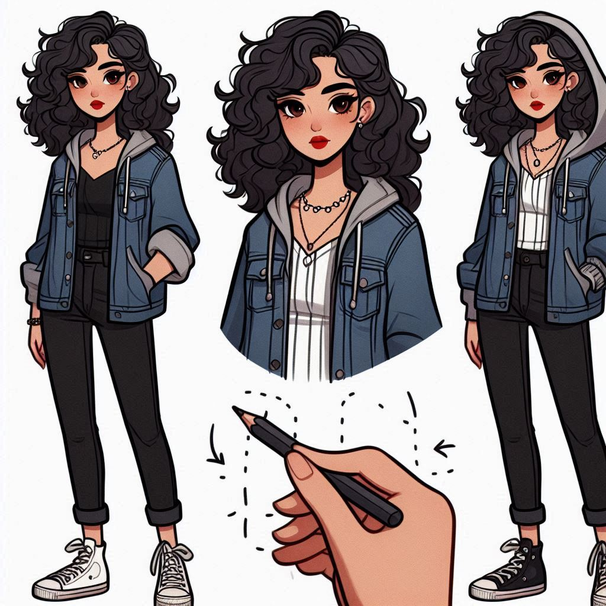

# Copilot_custom - Projeto do Bootcamp  da DIO Microsoft Copilot AI
# Projeto de Reconhecimento de Texto em Imagens com Microsoft Copilot

Este projeto demonstra o uso do Microsoft Copilot para realizar o reconhecimento de texto em imagens. O objetivo é extrair e processar texto a partir de imagens fornecidas.

## Estrutura do Repositório

- **inputs/**: Pasta contendo as imagens usadas para o reconhecimento de texto.
- **output/**: Pasta onde os resultados do reconhecimento de texto são armazenados.

## Como Usar

1. **Preparação das Imagens:**
   - Coloque as imagens que você deseja processar na pasta `inputs/`.

2. **Processamento com Microsoft Copilot:**
   - Utilize o Microsoft Copilot para gerar o código necessário para o reconhecimento de texto.
   - Configure o ambiente conforme necessário para o Copilot.
   - Execute o código gerado pelo Copilot para processar as imagens na pasta `inputs/`.

3. **Armazenamento de Resultados:**
   - Os resultados do reconhecimento de texto serão salvos na pasta `output/`.
   - Verifique os arquivos na pasta `output/` para revisar o texto extraído.

4- Exemplo de prompts:

Desenhe uma mulher   com cabelos cacheados que caem sobre os ombros e o peito. Ela está vestindo uma jaqueta jeans de capuz para baixo  com uma peça listrada visível por baixo, colar prata, batom vermelho, olhos castanhos, calça preta e all star. Modelo de desenho da hora da aventura.Pele negra clara, magra.

### Imagem 8

### Imagem 12

### Imagem 14

